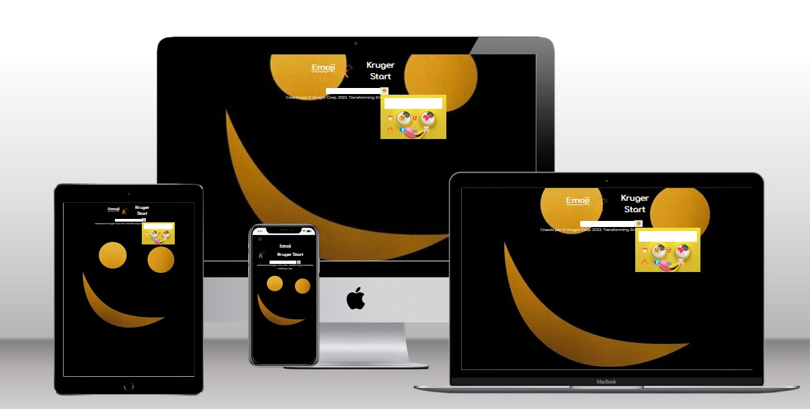

# App Emoji Selector creado con React 3 App de 5
## App3   

- In this repository you can  see 5  app  with  react Hooks  and  use States, developer with con React, in the "[Kruger Start](https://www.youtube.com/@KrugerCorp)   "

## Built With 👣👍🧑‍🏫

- 🪵           [HTML](https://lenguajehtml.com/html/)
- 🛖           [CSS SCSS](https://sass-lang.com/)
- 📚           [Git](https://github.com/)
- 🚙⚙️         [JavaScript](https://www.javascript.com/)
- 🌞⛅🌤️🌤️🌦️ [Weather Api](https://wheatherapp2xacr.netlify.app/)

## Getting Started

**In this repository I will upload some of my applications deveolped in Kruger Start.**

## Run it 🏃‍♂️🏁🏳️

Use the following steps to run this Portfolio locally:

- open the terminal

- get in the directory you want this folder to appear

- put: git clone https://github.com/xander06/emojiselector

- open the folder with a code editor (VS Code preferred)

- go to the index.html file and open it with live server

### Deployment 🫣😊👌😁

For a live demo please click on the following link ⏭️⏭️:
[5Proyectos 3 Emoji Selector](https://emojiselectorxacr.netlify.app/)

## Authors

👤 **Xavier Alexander Cangas**

- GitHub: [@Xander06](https://github.com/xander06)
- LinkedIn: [Alexander Cangás](https://www.linkedin.com/in/alexander-c-00a2967b/)

👤 **Vida MRR - Programacion web**

- [Youtube Vida MRR - Programacion web](https://www.youtube.com/@vidamrr)

## 🤝 Contributing

- [Youtube Vida MRR - Programacion web](https://www.youtube.com/@vidamrr)
- [Juan Sotomayor](https://github.com/Juanse7793) - Tutor Kruger star

Contributions, issues, and feature requests are welcome!

## License ©️

X@NDER06
**Free Software, Yeah!**
😎🧑‍💻🆓 
##
